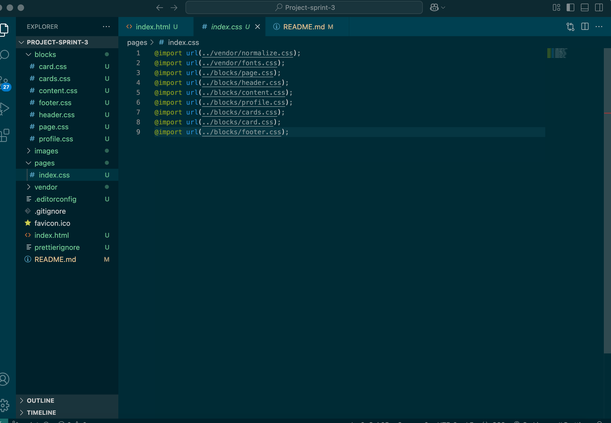
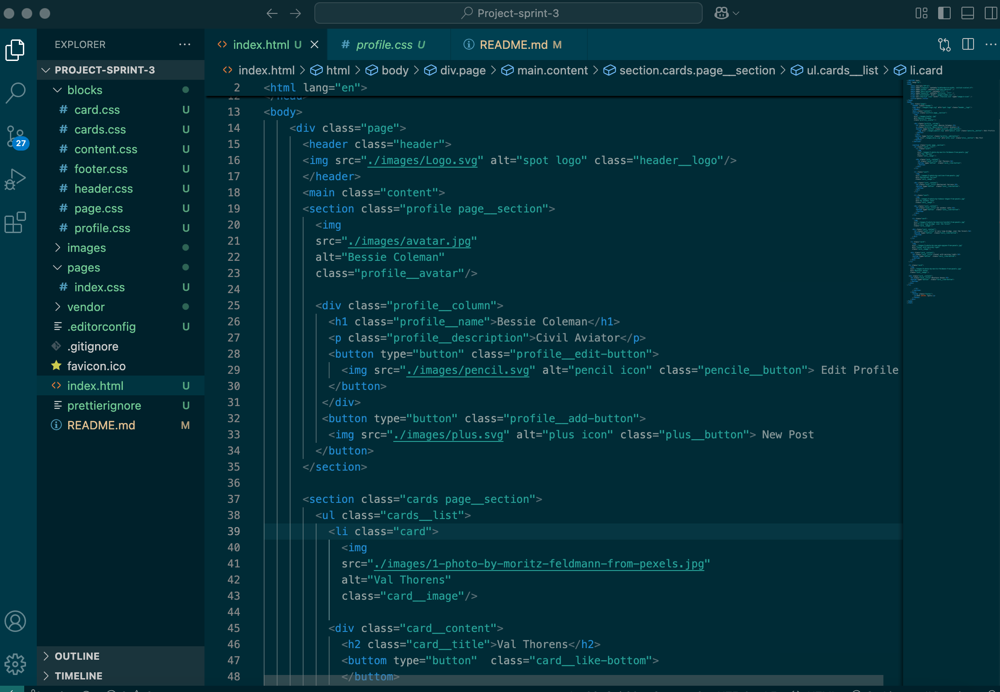
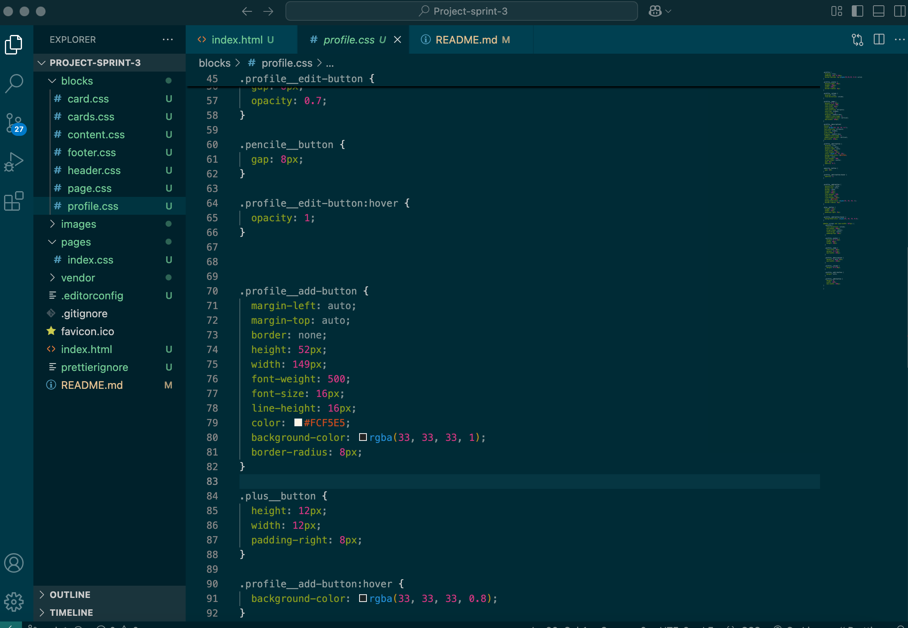
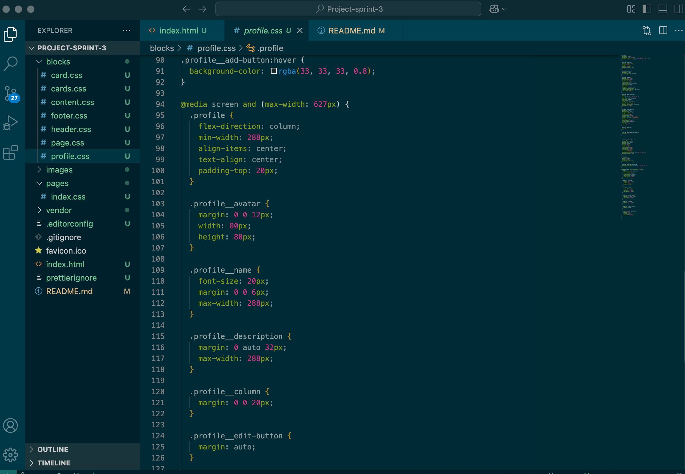

# Project 3: Spots

## Description of the project and functionality

This project is my first responsive web application, built with the aim of improving my skills in creating adaptable and user-friendly websites. I used various technologies to make the website responsive, including Media Queries to ensure it works across different screen sizes. To maintain clarity and organization in the code, I implemented the BEM (Block Element Modifier) methodology, which helps in managing naming conventions and creating a scalable structure.

One of the key features of the project is the hover functionality integrated into the buttons, which enhances interactivity. The goal of this project was to create a dynamic, interactive experience that is both visually appealing and functional, addressing the need for responsive design and intuitive user interaction.

## Technologies and techniques used 

* Semantic HTML5 and CSS 
* Flexbox 
* Positioning
* BEM file structure
* Responsive Design
* Media Queries  

## Pictures

  

## Link to project on GitHub Pages

* [Link to the project](https://gabrielab3.github.io/Project-sprint-3/)

## Link to the video in Drive
* [Link to the video](https://drive.google.com/file/d/1KlqCOt8J30VPYR8TkOlN7uLV6g3Mqqi3/view?usp=sharing)
  
**Figma**  
  
* [Link to the project on Figma](https://www.figma.com/file/BBNm2bC3lj8QQMHlnqRsga/Sprint-3-Project-%E2%80%94-Spots?type=design&node-id=2%3A60&mode=design&t=afgNFybdorZO6cQo-1)
  
 
  

